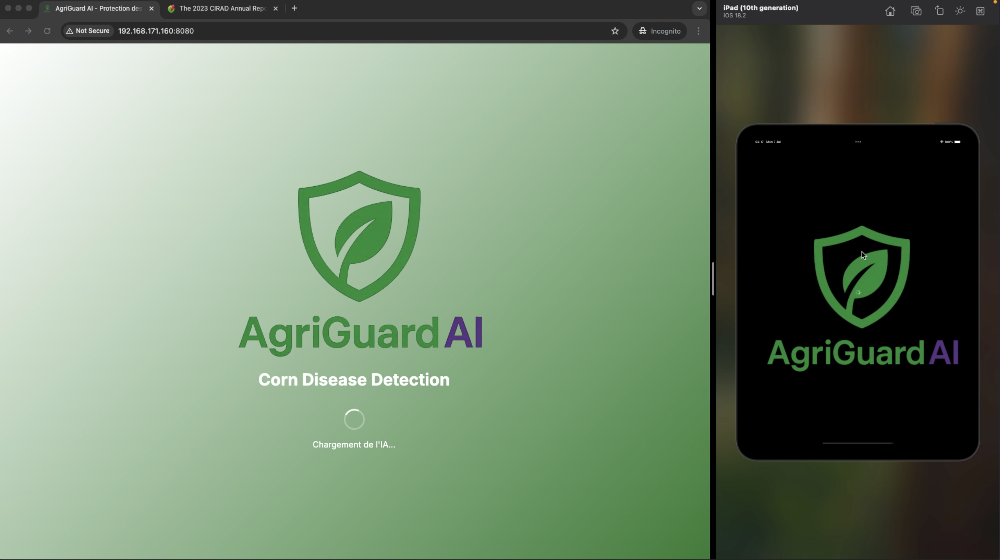
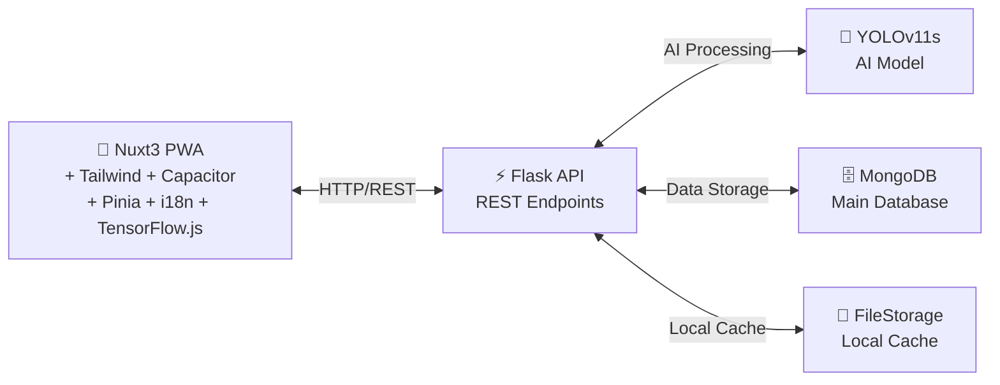

# AgriGuard AI - Setup MVP 


## 🚀 ARCHITECTURE TECHNIQUE


---
## 📋 SOFTWARE PREREQUISITES

### 🖥️ System Dependencies Installation

#### **Node.js 24.3**
```bash
# Via Node Version Manager (recommended)
curl -o- https://raw.githubusercontent.com/nvm-sh/nvm/v0.39.0/install.sh | bash
source ~/.bashrc
nvm install 24.3.0
nvm use 24.3.0
nvm alias default 24.3.0

# Verify installation
node --version  # should display v24.3.0
npm --version
```

#### **Python 3.10**
```bash
# Ubuntu/Debian
sudo apt update
sudo apt install python3.10 python3.10-venv python3.10-dev python3-pip

# macOS (with Homebrew)
brew install python@3.10

# Windows (download from python.org)
# https://www.python.org/downloads/release/python-3100/

# Verify installation
python3.10 --version  # should display Python 3.10.x
```

#### **MongoDB**
```bash
# Ubuntu/Debian
wget -qO - https://www.mongodb.org/static/pgp/server-7.0.asc | sudo apt-key add -
echo "deb [ arch=amd64,arm64 ] https://repo.mongodb.org/apt/ubuntu jammy/mongodb-org/7.0 multiverse" | sudo tee /etc/apt/sources.list.d/mongodb-org-7.0.list
sudo apt update
sudo apt install mongodb-org

# macOS
brew tap mongodb/brew
brew install mongodb-community

# Start MongoDB
sudo systemctl start mongod  # Linux
brew services start mongodb/brew/mongodb-community  # macOS

# Verify installation
mongosh --version
```

#### **OpenJDK 21+**

```bash
# Ubuntu/Debian
sudo apt update
sudo apt install openjdk-21-jdk

# macOS
brew install openjdk@21

# Windows (download from)
# https://adoptium.net/temurin/releases/

# Verify installation
java --version  # should display openjdk 21.x.x
```

#### **Conda (optional but recommended)**

```bash
# Miniconda (lightweight version)
wget https://repo.anaconda.com/miniconda/Miniconda3-latest-Linux-x86_64.sh
bash Miniconda3-latest-Linux-x86_64.sh

# Restart terminal then
conda --version
```

### 🔧 Environment Configuration

#### **Environment Variables**

```bash
# Add to ~/.bashrc or ~/.zshrc
export JAVA_HOME=/usr/lib/jvm/java-21-openjdk-amd64  # Linux
export JAVA_HOME=/opt/homebrew/opt/openjdk@21         # macOS
export PATH=$JAVA_HOME/bin:$PATH

# Reload configuration
source ~/.bashrc
```
---

## 🔧 BACKEND FLASK

### Project structure
```
agriguard-backend
├── app.py                                  # entry server
├── archived                                # archived for none use
│     ├── app.py
│     ├── app2.py
│     └── convert_yolo_to_tfjs.py
├── data                                    # diseases and pest database in file
│     ├── diseases_database.json
│     ├── maize_diseases_json.json
│     ├── mln.json
│     └── pest_database.json
├── environment.yml                         # conda requirement env
├── models
│     ├── __init__.py                       # init module folder file
│     ├── archived                          # archived for none use
│     │     ├── __init__.py
│     │     ├── database_manager.py
│     │     ├── yolo_model_cls.py
│     │     └── yolo_model.py
│     ├── database_manager.py               # db connector strategy
│     └── yolo_model_cls_db.py              # classifier
├── requirements.txt                        # pyenv requirement
├── schemas                                 # entities schemas and mongodb modeling
│     ├── __init__.py
│     └── schemas.agriguard.py
├── storage                                 # persistant storage
├── utils
│     ├── __init__.py
│     └── image_processing.py               # data modeling for classifier
└── weights
    └── best.pt                             # trained model weight

```

## 🔧 FRONTEND FLASK

### Project structure
```
corn-disease-app
├── app.vue                                     # entry view
├── assets                                      # private assets
│     └── css
│         └── main.css
├── capacitor.config.ts                         # capacitor configs
├── components                                  
│     ├── analyze                               # for analyze page
│     │     ├── BatchClassificationCard.vue
│     │     ├── BatchImageUploadActions.vue
│     │     ├── BatchImageUploadArea.vue
│     │     ├── ClassificationDetails.vue
│     │     ├── ClassificationHeader.vue
│     │     ├── ClassificationResults.vue
│     │     ├── ClassificationStatus.vue
│     │     ├── ConfidenceBadge.vue
│     │     ├── ImageUploadSection.vue
│     │     ├── NoDetectionMessage.vue
│     │     ├── PreventionSection.vue
│     │     ├── SeverityBadge.vue
│     │     ├── SingleClassificationCard.vue
│     │     ├── TreatmentSection.vue
│     │     └── UrgencyBadge.vue
│     ├── archived                              # archived for none use
│     │     └── TreatmentCard.vue
│     ├── DetectionCard.vue
│     ├── DetectionDescription.vue
│     ├── DetectionHeader.vue
│     ├── DetectionResults.vue
│     ├── DiseasesSectionHeader.vue
│     ├── ErrorMessage.vue
│     ├── FeatureCard.vue
│     ├── ForumCard.vue
│     ├── i18n                                  # i18n component
│     │     └── InternationalisationButtons.vue
│     ├── ImageUploadActions.vue
│     ├── ImageUploadArea.vue
│     ├── landing                               # for landing page
│     │     ├── AboutUsSection.vue
│     │     ├── BlogSection.vue
│     │     ├── CommunityAlertCard.vue
│     │     ├── CommunityEcosystem.vue
│     │     ├── DiseaseDetectionSection.vue
│     │     ├── FaqSection.vue
│     │     ├── FooterSection.vue
│     │     ├── ForumSection.vue
│     │     ├── HeroSection.vue
│     │     ├── KeyStatsSection.vue
│     │     ├── MarketplaceSection.vue
│     │     └── StatCard.vue
│     ├── LoadingButton.vue
│     ├── MarketplaceAddProductCard.vue
│     ├── MarketplaceProductCard.vue
│     ├── MentoringCard.vue 
│     ├── nav                                   # for nav section
│     │     ├── AnalyzeButton.vue
│     │     ├── AppLogo.vue
│     │     ├── AuthButtons.vue
│     │     ├── CameraIcon.vue
│     │     ├── DesktopNavMenu.vue
│     │     ├── MobileAuthButtons.vue
│     │     ├── MobileMenu.vue
│     │     ├── MobileMenuButton.vue
│     │     ├── MobileUserInfo.vue
│     │     ├── MobileUserMenu.vue
│     │     ├── NavigationBar.vue
│     │     ├── NotificationBell.vue
│     │     ├── UserActions.vue
│     │     └── UserDropdown.vue
│     ├── network                               # for network monitoring component
│     │     └── OfflineIndicator.vue
│     ├── pwa                                   # for pwa installer component
│     │     └── PwaInstallPrompt.vue
│     └── rgpd
│         └── CookieConsent.vue                 # for cookies about rgpd
├── composables                                 # compasables components
│     ├── useMaizeClassifier.js
│     └── useSplashScreen.ts
├── i18n                                        # i18n dictionary
│     └── locales
│         ├── en.json
│         └── fr.json
├── i18n.config.ts                              # i18n configs
├── layouts                                     # app layer view
│     └── default.vue
├── middleware                                  # routing middleware
│     └── guest.js
├── nuxt.config.ts                              # entry nuxt app file
├── package-lock.json
├── package.json                                # dependencies and project declaration
├── pages                                       # app pages
│     ├── about-us.vue
│     ├── analyze.vue
│     ├── auth.vue
│     ├── blog.vue
│     ├── faq.vue
│     ├── forum.vue
│     ├── index.vue
│     └── privacy-policy.vue
├── plugins                                     # plugins operator
│     ├── capacitor.ts
│     ├── pinia-persist.ts
│     └── tensorflow.ts
├── public                                      # public directory
│     ├── favicon.ico
│     ├── img1.jpeg
│     ├── img2.png
│     ├── ios-icons
│     │     ├── icon-1024.png
│     │     ├── icon-20.png
│     │     ├── icon-20@2x.png
│     │     ├── icon-20@3x.png
│     │     ├── icon-29.png
│     │     ├── icon-29@2x.png
│     │     ├── icon-29@3x.png
│     │     ├── icon-40.png
│     │     ├── icon-40@2x.png
│     │     ├── icon-40@3x.png
│     │     ├── icon-60@2x.png
│     │     ├── icon-60@3x.png
│     │     ├── icon-76.png
│     │     ├── icon-76@2x.png
│     │     ├── icon-83.5@2x.png
│     │     └── icon.png
│     ├── logo.png
│     ├── robots.txt
│     └── splash
│         └── splash-2732.png
├── README.md                                   # front readme file
├── server
│     └── tsconfig.json
├── services                                    # services
│     └── PermissionManager.ts
├── stores                                      # pinia store models
│     ├── auth
│     │     └── index.js
│     ├── locale
│     │     └── index.js
│     ├── pwa
│     │     └── index.js
│     └── settings
│         └── index.js
├── tailwind.config.js                          # tailwind config
├── tsconfig.json
├── types                                       # nuxt global types definition
│     └── pwa.d.ts
└── utils                                       # utilities
    ├── api-request.js
    └── persist-storage.ts
```

## ⚡ RAPID DEPLOYMENT
### 1. Frontend Generation
```bash
# Se position dans le repertoire frontend
cd corn-disease-app

# installer les dependances
# etre sur node 24
npm i

# generer les minifies du projet pour web
npm run generate
# utiliser capacitor pour construire la version ios et android
npm run cap:build && npm run cap:ios && npm run cap:android
# revenir à la racine
cd ..
```

### 2. Launch the project via the BACKEND

* py-env
```bash
# is located in the backend directory
cd agriguard-backend
# Create virtual environment
python -m venv conia2025
source conia2025/bin/activate  # Linux/Mac
# ou
conia2025\Scripts\activate     # Windows

# Install dependencies
pip install -r requirements.txt

# Launch server
python app.py
```

*  conda
```bash
# is located in the backend directory
cd agriguard-backend
# Create virtual environment
conda env create -f environment.yml

# Activate environment
conda activate conia2025 

# Start server
# the front web service can be accessed directly
# as a static server file# Start server
# the front web service can be accessed directly 
# as a server static file
python app.py
```


### 3. Test complet
```bash
# Frontend: http://localhost:3000
open http://localhost:3000
# API: http://localhost:3000/api
# Test API: http://localhost:3000/api/health
open http://localhost:3000/api/health
```

---

## 🎯 CHECKLIST MVP PRÉ-HACKATHON

### ✅ Basic features
- [x] Upload/camera interface
- [x] Display results
- [x] Design responsive
- [ ] Test data
- [x] API functional endpoints

### ✅ Optimisations
- [x] Fast loading
- [x] Error management
- [ ] User feedback
- [x] Mobile-friendly
- [x] Offline fallback

### ✅ Demo Ready
- [x] Prepared test images
- [x] Demo scenarios
- [ ] Realistic data
- [ ] Performance fluide


### Note

- If you do not have node 24.x or npm installed to your machine, download and install the runtime from [node](https://nodejs.org/en/download/package-manager)
---

## 👥 DIGITAL FAMERS - TEAM' MEMBERs

<div align="center">
  <table>
    <tr>
      <td align="center">
        <a href="https://github.com/VictorNico">
          
          <br />
          <strong>@VictorNico</strong>
        </a>
        <br />
        <sub>Team Leader</sub>
      </td>
      <td align="center">
        <a href="https://github.com/Landry90">
          
          <br />
          <strong>@Landry90</strong>
        </a>
        <br />
        <sub>Member</sub>
      </td>
      <td align="center">
        <a href="https://github.com/Lerespoderrick">
          
          <br />
          <strong>@Lerespoderrick</strong>
        </a>
        <br />
        <sub>Member</sub>
      </td>
      <td align="center">
        <a href="https://github.com/BillTanekeu">
          
          <br />
          <strong>@BillTanekeu</strong>
        </a>
        <br />
        <sub>Member</sub>
      </td>
      <td align="center">
        <a href="https://github.com/belvianekeufack">
          
          <br />
          <strong>@belvianekeufack</strong>
        </a>
        <br />
        <sub>Member</sub>
      </td>
    </tr>
  </table>
</div>

# Contribute

## 🚀 Flux Git

- **Branch names**
    - Use the : `<numéro_issue>-<issue>`

- **Local changements**
    - `git status`
      - in red, changes not added
      - in green, those already added and awaiting acceptance
  
- **Commits**
    - add your local changes to the git files,
      - `git add filename_name1 filename_name2` or
      - `git add .` to say it all
    - accept changes add to upload to repo
      - `git commit -m $message`
    - Commit messages (`$message`) must follow the format :  
      `" | <nom_auteur> |#<numéro_issue>| <description_du_travail>|"`
    - **Example** :  
      `"|@VictorNico|#1| configuration du projet |"`
    - The number refers to the **issue** (ticket) you're working on.

- **Push**
    - Check for changes on the main branch:
      `git pull`
      - If there are any branch changes in the list of changed branches,
        - make the tablecloth **Commits**
        - enter upcomming changes with `git merge origin/main` on your issue branch
        - in the normal case
          - you may be asked for a confirmation message (commit message), preferably in the description part, insist on the timestamp
              - example: `|@VictorNico| accept hand changes on 06/28/2025 20:02|`
          - save and close
          - otherwise, there may be conflicts
              - if you're not sure about a change, don't act on it. wait for help
                - then you may be asked for a confirmation message (commit message), preferably in the description part insist on the timestamp
          - example: `|@VictorNico| accept changes of hand on 28/06/2025 20:02|`
          - save and close
          - otherwise, there may be conflicts
          - you'll have to deal with conflicts efficiently, if you're not sure of a change don't act. wait for help
          - then, `git push ` ou `git push -u origin <numéro_issue>-<issue>`
      

- **Pull Requests (PR)**
  - If the PR concerns an **existing plant**, be sure to **include it in the description** so that it is automatically closed when the PR is approved.
    - Use one of the following commands:If the PR concerns an **existing plant**, be sure to **include it in the description** so that it is automatically closed when the PR is approved.
  - Use one of the following commands:
    - `Resolves #<numéro_issue>`
    - `Fixes #<numéro_issue>`
    - `Closes #<numéro_issue>`
    - Always assign the PR to **yourself** and **your teammate**.

---
**Happy Coding Everyone 🚀**
